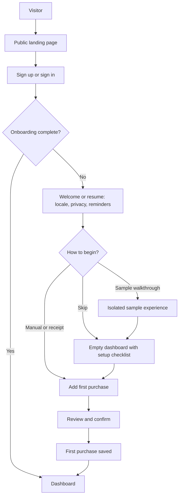
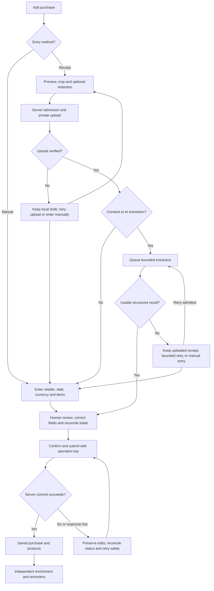
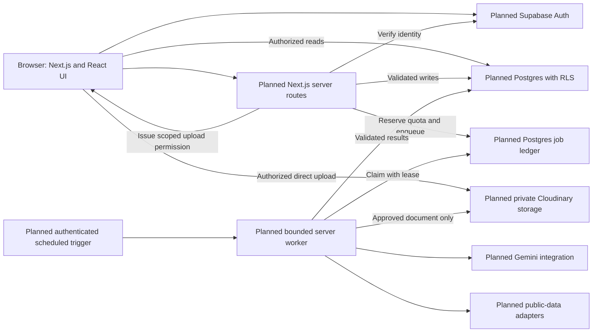
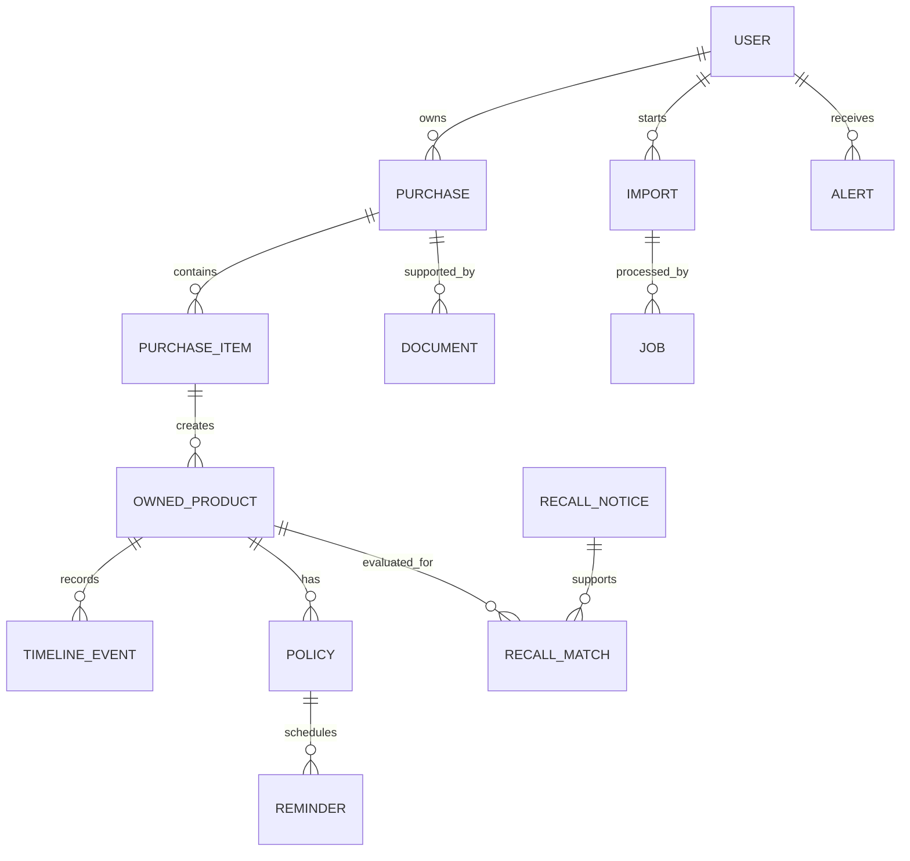
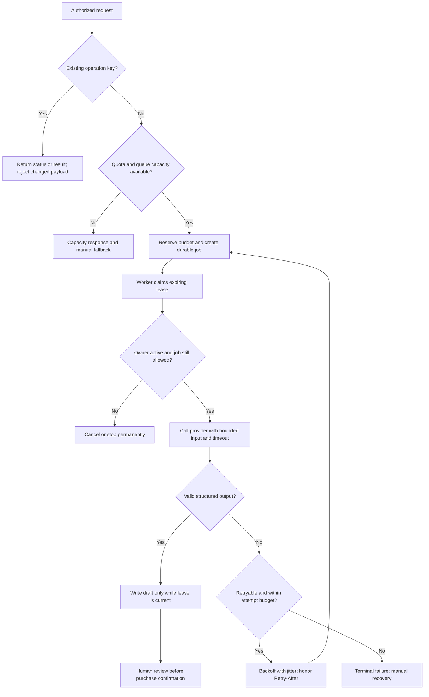

# AfterBuy

**Everything that happens after you buy something.**

AfterBuy is a consumer purchase-management project being built to bring receipts, owned products, return deadlines, warranty information and potential safety notices into one place. It is intended for adults managing personal purchases, including users in Nigeria, with country, currency and timezone preferences.

Receipts get lost, return windows are easy to forget, and product identifiers are rarely available when a warranty claim or safety notice needs attention. AfterBuy's intended outcome is a useful ownership record that helps someone decide what to do next.

**Current milestone: project foundation.** This repository contains a configured Next.js starter application. The purchase-management experience is designed but has not been implemented. It is not a production-ready service, and there is no working product demo yet.

## Contents

- [Development status](#development-status)
- [Core purchase journey](#core-purchase-journey)
- [Planned feature areas](#planned-feature-areas)
- [Technology choices](#technology-choices)
- [Architecture and trust boundaries](#architecture-and-trust-boundaries)
- [Data relationships](#data-relationships)
- [Privacy and security design](#privacy-and-security-design)
- [Jobs, load and failure recovery](#jobs-load-and-failure-recovery)
- [Avoiding unnecessary API calls](#avoiding-unnecessary-api-calls)
- [Local development](#local-development)
- [Verification](#verification)
- [Repository structure](#repository-structure)
- [Roadmap](#roadmap)
- [Known limitations and open decisions](#known-limitations-and-open-decisions)
- [Contributing and reviewing](#contributing-and-reviewing)

## Development status

Status is based on repository inspection and local checks on **18 September 2026**. “Configured” means the relevant source or configuration exists; it does not imply a completed product experience or a browser accessibility audit.

| Area | Current repository | Designed or deferred work |
| --- | --- | --- |
| Application foundation | Next.js App Router in `src/app/`, strict TypeScript, Tailwind, React Compiler and `@/*` alias configured | Product routes, navigation and reusable UI |
| Home and root layout | Create Next App page, starter metadata, logos and root layout | AfterBuy landing page and separate public/auth/app layouts |
| Appearance | Starter CSS follows the system dark-mode preference | Explicit System/Light/Dark switching and a complete theme system |
| Quality checks | Lint, type checking and production build passed on the maintainer's local Mac | Automated behavior tests, accessibility checks, load tests and CI |
| Purchases and products | Not implemented | Manual entry, review, inventory, editing and timelines |
| Accounts and private data | Not implemented | Supabase Auth, database schema, ownership checks and RLS |
| Receipt capture and AI | Not implemented | Private uploads, consent, redaction, queued extraction and human review |
| Ownership information | Not implemented | Returns, warranties, reminders, spending and evidence-based safety alerts |
| Guided learning | Not implemented | Resumable onboarding, synthetic demo and replayable Learning Center |
| Later expansion | Not implemented | Warranty PDF extraction, households and permissioned sharing; additional recall-source coverage |

The inspected Git history contains an initialization commit and `bd20198` (`chore(setup): add Next.js application foundation`). These establish the scaffold, not the planned workflows. The latest maintainer-reported local check results are listed under [Verification](#verification).

## Core purchase journey

The intended journey is **add a purchase → review its information → confirm an ownership record → receive useful reminders → take action**. A first confirmed purchase is the proposed activation milestone, rather than account creation alone.

Manual entry is a first-class path. A user should be able to record a retailer, purchase date, currency and items without providing an image or contacting an AI provider. It remains useful when a receipt is missing, extraction is inaccurate, consent is declined or an external service is unavailable. This independence from AI and storage providers still needs to be implemented and tested.

### Visitor to first purchase

**Planned journey; these screens and transitions are not built.** Returning users should resume relevant progress, and onboarding should be skippable.



### Manual entry and receipt capture

**Planned workflow.** Extraction creates an editable draft; only human confirmation should create the canonical purchase. Optional enrichment follows the save and must not block it.



## Planned feature areas

**Everything in this section is specified, not implemented.**

| Area | Intended experience and engineering boundary |
| --- | --- |
| Purchases | Searchable transactions with retailer, date, currency, line items and notes; review before save, revision-aware editing and separate refund records |
| Products | Inventory linked to purchase items, model/barcode identifiers, service history and explicit ownership states such as owned, returned, sold or archived |
| Receipts and documents | Private attachment library, preview and download, upload recovery, retention choices and deletion of originals and derived files |
| Returns | User-confirmed policy, source and counting basis; unknown terms remain unknown instead of producing a guessed deadline |
| Warranties | Coverage, exclusions, supporting documents, expiry and timeline; automated warranty PDF extraction is deferred |
| Safety alerts | Potential matches with official source, jurisdiction, matching identifiers, missing information and last-checked time; a missing match does not establish product safety |
| Spending | Currency-separated category and retailer summaries, recorded refund adjustments, and accessible table alternatives to charts |
| Notifications | In-app inbox and calendar export first; preference-aware reminders and deduplicated delivery; browser push after the initial reminder flow |
| Onboarding | Resumable locale/privacy setup, manual or receipt entry, sample walkthrough and skip options; reusable purchase forms |
| Learning Center | Replayable modules using sample data, available after onboarding without requiring the user to repeat setup |

The Learning Center specifies **11 modules**: overview, adding a purchase, purchases, products, returns and warranties, safety alerts, spending, documents, notifications, settings, and a later household-sharing module. Advancing a tour must not trigger real deletions, uploads, AI submissions, exports, invitations or notification opt-ins.

AfterBuy is intended to organize evidence and reminders. It does not promise refunds, determine legal rights, certify safety or automatically contact retailers. Bank connections, whole-inbox ingestion and executing purchases are outside the first-release scope.

## Technology choices

### Present in the repository

Versions below are resolved from the locally installed packages during inspection. `bun.lock` records dependency resolution; some manifest entries use version ranges.

| Technology | Version/configuration | Current use |
| --- | --- | --- |
| Next.js | 16.3.5, App Router | Starter page and root layout; Turbopack through the standard scripts |
| React / React DOM | 19.2.8 | UI rendering |
| TypeScript | 5.9.3; `strict: true` | Typed source and configuration; `@/*` maps to `./src/*` |
| Tailwind CSS | 4.3.3 | Global stylesheet and utility classes through `@tailwindcss/postcss` |
| React Compiler | Enabled; plugin 1.0.0 | Compiler configuration in `next.config.ts` |
| ESLint | Major version 9 | Next.js Core Web Vitals and TypeScript configurations |
| Bun | 1.4.2 | Declared package manager, dependency lockfile and script runner |

### Planned integrations and rationale

| Choice | Intended role | Reason and unresolved boundary |
| --- | --- | --- |
| Next.js Route Handlers | Trusted application API | Keep admission, validation and provider credentials on the server; no route handlers exist yet |
| Supabase Auth and PostgreSQL | Identity, relational records, RLS and durable jobs | Purchases, products and documents have linked ownership; privileged server operations still need explicit authorization |
| Cloudinary | Private document storage and derived previews | Direct authorized uploads could keep large file bodies out of app routes; private delivery and deletion behavior must be verified |
| Gemini | Optional receipt extraction and evidence explanations | Reduce typing while retaining structured validation and human review; model selection and data terms remain open |
| Open Food Facts | Barcode metadata candidates | Reuse public identifiers; coverage, licensing and attribution need review |
| CPSC / openFDA | Candidate official safety-data sources | Preserve source evidence and jurisdiction; stage adapters and validate coverage before selecting the initial source |
| PostgreSQL job ledger and scheduled runner | Bounded background processing | Durable status and retries without a separately managed queue service; dispatch timing and hosting feasibility need validation |
| Vercel / GitHub Actions | Candidate hosting and scheduled invocation | Deployment and scheduling are proposals; no deployment configuration or workflows establish operational behavior |
| React Hook Form, Zod, TanStack Query | Forms, validation and remote-data state | Proposed separation of form state, domain rules and cached records; these packages are not installed |

The budget goal is a small, bounded pilot using suitable provider allowances. It is **not a promise of permanent zero-cost operation**. Provider eligibility, quotas, prices and permitted usage need checking before enabling integrations.

## Architecture and trust boundaries

**Target architecture, not the current deployment.** Only the Next.js/React scaffold exists today; every integration, API, database policy and worker shown below is planned.



| Boundary | Intended responsibility |
| --- | --- |
| Browser → server | Browser state is untrusted. Derive identity from the verified session, validate input and check ownership before accepting writes or expensive work. UI controls alone cannot enforce a quota. |
| Browser → database | Permit only deliberately supported, bounded reads under default-deny RLS. Canonical mutations go through the server; direct access must not bypass quotas or protected fields. |
| Server → database | Privileged credentials are server-only. Check parent/child ownership and allowed fields explicitly; privileged access does not inherit safety merely because RLS exists. |
| Browser/server → storage | Admit one intended object, verify the finalized upload and authorize reads separately. A signed upload or an HTTPS URL alone does not prove the stored document is private. |
| Worker → AI | Send only the consented document or necessary evidence. Treat document text and model output as untrusted; AI cannot authorize an action or choose an owner, query or storage path. |
| Worker → public providers | Send necessary public product identifiers, not private receipts, emails or purchase histories. Keep shared public caches separate from private records. |

Domain rules are intended to remain independent of UI components: integer minor-unit money calculations, explicit currency precision, local purchase dates, confirmed policy calculations and explainable identifier matching. AI should suggest information, not silently overwrite user-confirmed facts.

## Data relationships

**Conceptual model only; there are no database migrations or tables implemented in this repository.** This diagram shows the important relationships rather than a complete schema.



A purchase is the transaction; a product is something owned. Keeping them separate supports multi-item receipts, product-specific timelines and refunds without double-counting spending. Fields derived from extraction or public sources should retain provenance, observation time and user-confirmation state. Internal job payloads should remain server-only, with a separate safe status view for the user.

## Privacy and security design

**These are intended controls, not active protections or guarantees.** They require implementation and negative tests before a real-user pilot.

| Concern | Planned approach and verification needed |
| --- | --- |
| Ownership and isolation | Default-deny RLS, server-derived user identity, scoped lookups and parent/child ownership validation. Test that one account cannot read, edit, delete or export another account's records. |
| Account and session protection | Verified identity, safe recovery flows, recent authentication for sensitive actions, session revocation and private-cache clearing on sign-out. Validate any proposed session-version mechanism across API and direct database access; do not assume instantaneous global revocation. |
| Private files | Restricted upload authorization, object ownership checks, size/type validation and authenticated or appropriately scoped delivery. Test originals, thumbnails, derivatives and exports for unintended access. |
| Consent and redaction | Explain current provider handling before optional extraction; allow cropping/redaction and manual entry. Redaction is best-effort and needs output-byte validation, not just a visual overlay. |
| Quotas and abuse | Atomic per-account and global reservations, bounded payloads, cooldowns and independent controls for uploads/AI/enrichment. Use IP signals cautiously because legitimate users may share a network. |
| Safe rendering and request handling | Validate structured AI output and allowed links, avoid arbitrary HTML, and implement appropriate browser/session and request protections. Receipt text must never become executable instructions. |
| Safe logging | Log request IDs, timings, counts and safe error codes; exclude receipt bodies, tokens, signed file URLs, complete prompts and unnecessary personal data. |
| Retention, export and deletion | Make retention explicit; reauthenticate sensitive requests; cancel jobs and remove related originals, derivatives and records. Reconcile failed cleanup and prevent late workers from recreating deleted data. |

Account deletion is an operational workflow to verify, not a claim of cryptographic erasure. Provider backup/retention behavior needs review, and copies already downloaded by a user cannot be remotely removed. No legal retention period or deletion deadline is asserted here.

## Jobs, load and failure recovery

**Proposed behavior.** Manual purchase work and saved records should remain usable during AI or enrichment outages when the app and database are available. Database outages still prevent confirmed saves; the UI must preserve an in-memory draft and explain that closing the tab can lose it.

### Bounded background processing

The planned job ledger separates request admission from processing. Admission should reserve quota and record the operation atomically. An idempotency key scoped to the user and action lets a repeated request return the existing result; reusing the key with a different payload should produce a conflict.



The loop represents another attempt at the **same job**, not a fresh operation with reset quotas. Invalid input, revoked access and deleted resources should stop processing. Transient provider failures may retry within a cap; malformed AI output may receive at most one repair attempt within the overall budget. Scheduling, leases and recovery after worker interruption all need tests.

### Proposed limits, not measured capacity

These are starting proposals from the blueprint, **not provider entitlements, active configuration or benchmark results**:

| Proposal | Intended purpose |
| --- | --- |
| Up to 5 extraction requests per account per day | Bound expensive work per user |
| Up to 10 MiB per receipt image | Bound upload size; actual provider rules and validation remain to be checked |
| One running and two waiting extraction jobs per user | Prevent one account monopolizing processing |
| Global pending-job cap of 100 | Prevent unbounded backlog growth |
| At most 3 total attempts for transient failures | Bound retry amplification; repair attempts must fit the budget |

Actual values must follow provider checks and tests using stubs. No throughput, concurrency, page-performance or queue-drain target has been measured for the product.

Under pressure, the planned response is to reuse cached data, show queue status, reduce admitted expensive work and pause individual integrations when needed. A missing quota store should block new expensive admissions. A lost save response should be reconciled through the same operation key; a failed upload should not be shown as complete. If storage succeeds but database attachment fails, reconciliation and orphan cleanup are required.

An AI outage should offer manual entry with the available receipt. A public-data outage should show stale or unavailable evidence with its last successful check. The proposed synthetic `/demo` would avoid live uploads and AI calls, but that route does not exist yet.

## Avoiding unnecessary API calls

**Planned request policy:**

| Technique | Intended application |
| --- | --- |
| Cache public metadata | Reuse barcode results by identifier and locale; use shorter negative caching for unknown products |
| Deduplicate requests | Coalesce concurrent refreshes behind one expiring lease; reuse the existing extraction operation on reload |
| Refresh in the background | Ingest changed safety notices centrally and re-evaluate affected identifiers rather than querying providers for every page view |
| Scope private queries | Include account and filters in cache keys, paginate records, clear private caches on sign-out and invalidate only affected queries |
| Bound polling | Poll only active jobs, stop on terminal status or sign-out, and avoid simultaneous subscriptions and polling for the same work |
| Avoid accidental work | Debounce search, cancel superseded requests and require deliberate actions for costly processing |
| Keep deterministic work local or server-side | Calculate totals, dates, refund adjustments and match rules without AI; search already available records without provider calls |

The blueprint suggests cache lifetimes and refresh intervals, but those are tuning proposals. Freshness labels and source timestamps are necessary when serving stale information. No cache layer, ingestion scheduler or request-deduplication mechanism is implemented yet.

## Local development

### Prerequisites

- **Bun 1.4.2**, matching the `packageManager` field.
- **Node.js 20.9 or newer**, the minimum stated in this installed Next.js version's bundled guide. Inspection used Node.js 24.12.0; that is not an additional pinned project requirement.
- Network access for dependency installation and the starter's Google-hosted Geist fonts.

From your clone of this repository:

```bash
cd afterbuy
bun install --frozen-lockfile
bun run dev
```

Open [localhost:3000](http://localhost:3000), or the address printed by Next.js if it selects another port. Expect the Create Next App starter page. Installation is an instruction for developers; no packages were installed as part of this README update.

**Environment variables:** none are currently required by the application code. There is no need to configure Supabase, Cloudinary or Gemini to run the scaffold. Provider variables should be documented when integrations actually require them. Local `.env*` files are ignored by Git; never commit secret values.

To build and run a production server locally:

```bash
bun run build
bun run start
```

Run `start` only after a successful build. The current layout uses `next/font/google`, so a build may need access to Google's font endpoints. Hosting and deployment behavior have not been established by this repository.

## Verification

These commands come from the actual `package.json`. The latest results below were reported by the maintainer from a successful local Mac verification run. Codex also independently passed lint and type checking during the earlier documentation review.

| Command | Script | Availability and observed result |
| --- | --- | --- |
| `bun run dev` | `next dev` | Configured; interactive app behavior was not reviewed during this README update |
| `bun run lint` | `eslint` | **Passed** on the maintainer's local Mac |
| `bun run typecheck` | `next typegen && tsc --noEmit` | **Passed** on the maintainer's local Mac; route types are generated before TypeScript checks |
| `bun run build` | `next build` | **Passed** on the maintainer's local Mac; Next.js **16.3.5** compiled and generated `/` and `/_not-found` |
| `bun run start` | `next start` | Configured; not run during this update |
| Automated tests | — | **Not configured**; no test script or test suite found |
| CI | — | **Not configured**; no workflow files found |

Codex's earlier restricted-environment build attempts encountered Google Fonts network access and port-binding failures. The maintainer's subsequent successful Mac build is the latest build result; those earlier environment failures are not an outstanding application defect.

Passing lint, type checking and a production build does not verify runtime journeys, database isolation, private storage, provider failure handling or production deployment. Those features and their acceptance tests remain future work.

## Repository structure

Actual source, configuration and planning files at inspection time. Dependency directories, Git internals, generated build/type output and operating-system files are omitted.

```text
afterbuy/
├── docs/
│   ├── AfterBuy-Complete-Product-and-Engineering-Blueprint.md
│   └── AfterBuy-Product-Brief.md
├── public/
│   ├── file.svg
│   ├── globe.svg
│   ├── next.svg
│   ├── vercel.svg
│   └── window.svg
├── src/
│   └── app/
│       ├── favicon.ico
│       ├── globals.css
│       ├── layout.tsx
│       └── page.tsx
├── .gitignore
├── bun.lock
├── eslint.config.mjs
├── next.config.ts
├── package.json
├── postcss.config.mjs
├── README.md
└── tsconfig.json
```

The two `docs/` files exist locally but were **untracked** when this README was written; they need to be included when publishing the documentation for these links to resolve in a fresh clone. Local ignored files also include `AGENTS.md`, `CLAUDE.md` and `AfterBuy-Development-Timetable.md`. `AGENTS.md` instructs coding agents to consult the installed Next.js guides before writing code. These local files are not part of the tracked source tree.

## Roadmap

The [complete product and engineering blueprint](docs/AfterBuy-Complete-Product-and-Engineering-Blueprint.md) contains detailed workflows, data and security proposals, acceptance criteria and tickets AB-001–AB-024. The [product brief](docs/AfterBuy-Product-Brief.md) provides the product and design inventory. Both are planning inputs, not proof of implementation; historical provider and deployment assumptions need revalidation.

The **102 IDs describe screens and interaction states**, including dialogs, loading/error variants, onboarding steps and later features. They do **not** represent 102 implemented routes. The current application source contains one page route and a root layout.

| Stage | Intended exit evidence | Status |
| --- | --- | --- |
| Repository scaffold | App Router, strict typing, styling and repeatable local checks | Scaffold present; lint, type checking and build passed on the maintainer's Mac |
| Usable foundation | Accessible app shell, synthetic fixtures, manual purchase journey, inventory and timeline | Not built |
| Private core | Auth, schema, RLS, controlled writes and deletion with two-account isolation tests | Not built |
| Assisted capture | Private uploads, consent, redaction, durable jobs, editable extraction and recoverable failures | Not built |
| Ownership intelligence | Confirmed returns/warranties, reminders and currency-separated spending | Not built |
| Public-data intelligence | Staged product/recall adapters, evidence views and explicit missing coverage | Not built |
| Pilot hardening | Abuse controls, export/deletion evidence, failure tests, operational limits and accessible learning flows | Not built |
| Later expansion | Warranty PDF extraction, household roles/sharing and additional recall-source coverage | Deferred |

Concise progress checklist:

- [x] Configure the Next.js, TypeScript and Tailwind scaffold.
- [x] Enable lint and standalone type checking; verify both locally.
- [x] Complete a local production build with Next.js 16.3.5 (maintainer-reported Mac result).
- [ ] Build shared UI, theme controls and public/auth/app layout structure.
- [ ] Complete a manual purchase journey using synthetic fixtures.
- [ ] Add private persistence and prove ownership isolation.
- [ ] Introduce optional receipt extraction with reviewed, recoverable results.
- [ ] Add ownership insights, reminders and sourced safety evidence.
- [ ] Deliver a replayable Learning Center and an isolated portfolio demo.
- [ ] Validate security, accessibility, operational behavior and deployment before a private pilot.
- [ ] Revisit deferred expansion after the core journey is useful.

**Next milestone:** turn the scaffold into a usable foundation, beginning with the app shell and shared UI, then an end-to-end manual purchase journey. External services are later milestones; their absence is not a setup defect.

## Known limitations and open decisions

- There are no working purchase forms, persistent records, account flows, private uploads, AI jobs, recall matching, security controls or deployment evidence yet.
- The starter's system dark styling is not the specified theme-switching experience; accessibility and responsive product layouts remain unverified.
- No tests, CI, load measurements or operational monitoring are present. Planned performance numbers are targets, not results.
- Gemini model names, availability, quotas and data-handling terms in the planning documents are unverified. A model must be selected against current requirements before integration.
- Cloudinary upload restrictions, private delivery and cleanup, hosting execution limits, scheduled-job timing and Supabase inactivity behavior require implementation-specific validation. A proposed keep-alive ping is not an uptime guarantee.
- Safety-source jurisdiction and coverage need verification. US-oriented sources must not be presented as comprehensive Nigerian or worldwide coverage; sample notices must be labeled fictional.
- Return and warranty calculations require confirmed policy inputs. Planning examples do not establish legal deadlines or eligibility.
- Offline persistence is not implemented. The proposed pilot uses in-memory drafts and avoids persistent private browser caching by default.
- Free-tier suitability and cost controls need periodic review. A working pilot must not depend on an assumption of unlimited or permanently free service.

## Contributing and reviewing

This is a learning and portfolio project by **Abdulrahman Itseghosime Bello**. Reviews are most useful when they connect a concrete user journey to a clear engineering decision and reproducible evidence.

Before proposing a change, read the relevant blueprint section and identify whether the work belongs to the current foundation, a planned core stage or a deferred release. Keep changes focused; describe expected behavior, tradeoffs, failure states and the checks actually run. Use synthetic receipts and product data in examples, issues and test fixtures.

Run the available lint and type-check scripts for implementation changes, and attempt a production build in a suitable local environment. Record environment failures separately from code defects. Add behavior tests as domains and integrations are introduced, especially around money/dates, repeated saves, cross-account access and recovery after provider failures.

For a recruiter or technical reviewer, start with [Development status](#development-status), [Architecture and trust boundaries](#architecture-and-trust-boundaries) and [Verification](#verification). The present evidence is a typed, configured scaffold; the remaining sections explain intended decisions and the evidence required to claim those capabilities later.
