# AfterBuy — Complete Zero-Cost Product, Design, and Engineering Blueprint

**Everything that happens after you buy something.**

Prepared for Abdulrahman Itseghosime Bello • 17 September 2026 • Version 3.0 (Zero-Cost Comprehensive Specification)

**Status:** a specification to implement and test, not a claim that these features or protections already exist[cite: 1]. Capacity numbers, limits, deadlines and retention periods below are proposed starting settings designed specifically to operate safely within free-tier limits (Vercel, Supabase, Cloudinary, Gemini) without incurring cloud costs[cite: 1]. Sample products, policies and safety notices are fictional fixtures, not actual recall claims[cite: 1].

This document consolidates the AfterBuy concept: purchases, receipts, owned products, returns, warranties, safety notices, spending, onboarding, exhaustive design audits, and evidence-based AI assistance[cite: 1, 3]. It specifies privacy, account protection, request control, zero-cost queues, load behavior, testing, and a staged implementation plan across exactly 102 screens and states[cite: 1, 3].

Diagrams use Mermaid. Tables specify screen layouts and responsive behavior; they are design specifications rather than finished UI mockups[cite: 1].

## Contents

1. [Product purpose and boundaries](#1-product-purpose-and-boundaries)
2. [Zero-Cost architecture and feasibility](#2-zero-cost-architecture-and-feasibility)
3. [Scope and releases](#3-scope-and-releases)
4. [Complete screen, state, and responsive inventory (102 States)](#4-complete-screen-state-and-responsive-inventory-102-states)
5. [Onboarding, learning center, and demo](#5-onboarding-learning-center-and-demo)
6. [Receipt, redaction, and purchase workflow](#6-receipt-redaction-and-purchase-workflow)
7. [Data model, RLS, and ownership](#7-data-model-rls-and-ownership)
8. [Money dates and business rules](#8-money-dates-and-business-rules)
9. [Product enrichment](#9-product-enrichment)
10. [Recall matching and explanation](#10-recall-matching-and-explanation)
11. [AI boundaries and privacy](#11-ai-boundaries-and-privacy)
12. [React & Next.js architecture](#12-react--nextjs-architecture)
13. [API contracts and request admission](#13-api-contracts-and-request-admission)
14. [Preventing account theft](#14-preventing-account-theft)
15. [IP abuse and zero-cost quotas](#15-ip-abuse-and-zero-cost-quotas)
16. [Authorization and data isolation](#16-authorization-and-data-isolation)
17. [Upload pipeline and document security](#17-upload-pipeline-and-document-security)
18. [Preventing unnecessary API calls](#18-preventing-unnecessary-api-calls)
19. [Postgres jobs, retries, and idempotency](#19-postgres-jobs-retries-and-idempotency)
20. [Load capacity and graceful degradation](#20-load-capacity-and-graceful-degradation)
21. [Costs, quotas, and emergency controls](#21-costs-quotas-and-emergency-controls)
22. [Notifications and reminders](#22-notifications-and-reminders)
23. [Offline and synchronization](#23-offline-and-synchronization)
24. [Privacy retention export and deletion](#24-privacy-retention-export-and-deletion)
25. [Households and sharing](#25-households-and-sharing)
26. [Observability and incident response](#26-observability-and-incident-response)
27. [Testing and acceptance criteria](#27-testing-and-acceptance-criteria)
28. [Implementation tickets](#28-implementation-tickets)
29. [Recruiter demonstration and engineering evidence](#29-recruiter-demonstration-and-engineering-evidence)
30. [Launch checklist and open decisions](#30-launch-checklist-and-open-decisions)

---

## 1. Product purpose and boundaries

AfterBuy helps people keep purchase evidence, understand ownership deadlines and act on relevant information[cite: 1]. The recurring problem is fragmented information: receipts disappear, return dates are forgotten, warranty terms are unclear and product model numbers are hard to find when needed[cite: 1].

The main journey is **add purchase → review information → save ownership record → receive useful reminders → take action**[cite: 1]. A purchase remains valuable even when enrichment or AI is unavailable[cite: 1].

| User problem                        | Product response                                | Useful outcome                                            |
| ----------------------------------- | ----------------------------------------------- | --------------------------------------------------------- |
| Receipt is hard to find             | Private receipt linked to purchase and products | Proof of purchase is accessible[cite: 1]                  |
| Return period is unclear            | Confirmed policy, deadline and source           | User can decide when to contact retailer[cite: 1]         |
| Warranty information is scattered   | Coverage, exclusions, documents and timeline    | User can prepare a claim[cite: 1]                         |
| User forgets what they own          | Searchable product inventory                    | Model and purchase history are available[cite: 1]         |
| Safety notice may apply             | Explainable match against named public sources  | User can verify identifiers with official notice[cite: 1] |
| Spending is difficult to understand | Category and retailer analysis by currency      | User sees patterns without duplicate totals[cite: 1]      |
| Manual entry is tedious             | Optional structured receipt extraction          | Less typing, with human review[cite: 1]                   |

**Initial audience:** adults managing personal purchases, including users in Nigeria[cite: 1]. Let users choose country, currency and timezone[cite: 1]. Nigerian purchases are useful records even when external product or recall coverage is unavailable[cite: 1]. Do not present US datasets as comprehensive Nigerian or worldwide safety coverage[cite: 1].

**Product boundaries:** AfterBuy does not guarantee a refund, confirm legal warranty rights, prove a product is safe, replace manufacturer instructions or automatically contact retailers[cite: 1]. It does not connect to a bank, ingest an entire inbox or execute purchases in the first release[cite: 1].

Measure activation as a first confirmed purchase, not merely account creation[cite: 1]. Track successful manual entry, extraction correction rate, repeat usage and reminder usefulness[cite: 1]. Do not treat time spent in the app as the main success metric[cite: 1].

---

## 2. Zero-Cost architecture and feasibility

### 2.1 The important correction to the zero-cost stack

A React-only application cannot reliably enforce private AI budgets, global API quotas, scheduled processing and abuse limits using browser logic alone[cite: 1]. Users can modify browser code and call exposed services directly[cite: 1].

The recommended zero-cost real-user version uses **Next.js App Router + Supabase + Cloudinary + Free API Providers**. There is no need to manage an always-running Express server or pay for Firebase Blaze[cite: 1]. Serverless functions in Next.js constitute the backend, and learning where that boundary belongs is part of the project[cite: 1].

### 2.2 System topology

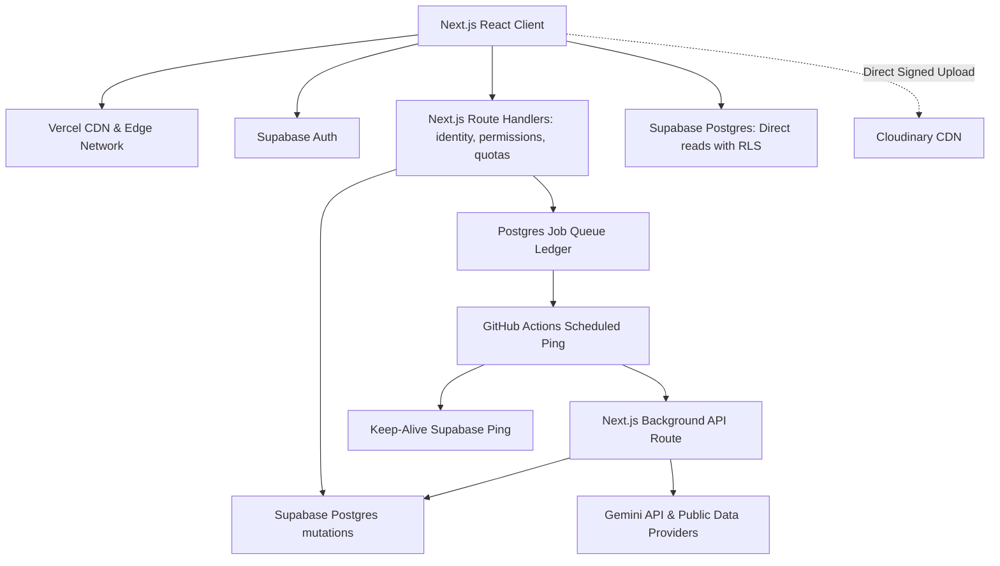

````

Reads from the browser are limited and authorized via Row Level Security (RLS); all canonical mutations, AI calls, exports, deletes and other costly actions pass through the trusted Next.js API. Uploads use a short-lived, exact-object authorization to Cloudinary after server admission. Workers never accept a user-supplied identity as proof of ownership.

| Component       | Responsibility                                              | Not responsible for           |
| --------------- | ----------------------------------------------------------- | ----------------------------- |
| Next.js / React | Forms, navigation, review, accessibility, local interaction | Trustworthy quotas or secrets |

|
| Supabase Auth | Establish user identity | Deciding ownership of a purchase

|
| Postgres RLS | Restrict supported client database access | Protecting privileged server operations

|
| Next.js API | Validate identity, ownership, input, quotas and session state | Rendering the interface

|
| Postgres Queue | Bounded expensive processing and retries | Deciding user consent

|
| Cloudinary | Private original and derived document objects | Proving a file is safe solely by its extension

|
| Gemini API | Extract or explain bounded evidence | Authorizing actions or determining truth

|

### 2.3 Two deployable modes

| Mode                     | Features                                                                                              | Operating boundary                                                |
| ------------------------ | ----------------------------------------------------------------------------------------------------- | ----------------------------------------------------------------- |
| Portfolio demo (`/demo`) | Synthetic receipts, sample extraction, editable local inventory, deterministic reminders and matching | No private uploads or live AI required; visible sample-data label |

|
| Private pilot | Real accounts, private files, server-controlled extraction, scheduled jobs | Operational quotas and privacy controls tested within free tiers

|

---

## 3. Scope and releases

| Release    | Included                                                           | Exit criterion                                 |
| ---------- | ------------------------------------------------------------------ | ---------------------------------------------- |
| Foundation | Design system, routes, fixtures, manual entry, inventory, timeline | One complete purchase journey works accessibly |

|
| Private core | Auth, Postgres RLS, controlled writes, receipts, deletion | Two users cannot access each other's data

|
| Assisted capture | Cloudinary upload, Gemini job, editable review, quotas | Failures preserve recoverable state; duplicates do not duplicate purchases

|
| Ownership intelligence | Confirmed returns/warranties, reminders, spending | Dates, currencies and revisions behave correctly

|
| Public-data intelligence | Barcode enrichment, CPSC/openFDA source, evidence display | Unknown products and incomplete coverage are explicit

|
| Hardening | Abuse protection, GitHub cron limits, incident controls | Gates in Section 27 pass

|
| Later expansion | Warranty PDF extraction, household roles, second recall source | Each capability has its own privacy and permission tests

|

Do not make all later features prerequisites to your first useful release.

---

## 4. Complete screen, state, and responsive inventory (102 States)

The UI must project a modern, calm, premium consumer-product identity using Tailwind CSS. Use strong hierarchy, readable typography, useful whitespace, refined borders and restrained motion. Suggested visual family: warm neutral light surfaces, charcoal text and teal actions, with amber warnings and red for destructive actions.

Deliver fully designed **Light and Dark modes** across all screens. Do not simply invert colors or put gray text on pure black everywhere. Preserve real receipt imagery on its natural paper background inside the dark viewer.

Responsive breakpoints: Desktop (1440 px), Tablet (768 px), Mobile (390 px). **Button wrapping rule:** Standard action labels must remain a single readable line. Ensure approximately 44 px touch targets for mobile.

### P — Public Website (7 Screens)

- **P01 Landing:** Hero, app preview, Get started/Explore demo, feature sections, privacy summary, FAQ, footer. Mobile uses stacked cards; desktop uses 3-column grids.

- **P02 Privacy & security overview:** Explicit data/AI boundaries, detailing Cloudinary retention and Gemini limits.

- **P03 Help/FAQ hub:** Categorized knowledge base with real-time text filter.

- **P04 Privacy policy page template:** Long-form layout with effective date.

- **P05 Terms page template:** Matching layout.

- **P06 Public 404 and 503 variants:** Navigation recovery screens.

- **P07 Demo entry/reset/exit (`/demo`):** Persistent sample-data label, no personal uploads allowed.

### A — Authentication and Security (10 Screens)

- **A01 Sign in:** Email/password and Google option.

- **A02 Sign up:** Field validation and password visibility.

- **A03 Verification pending:** Resend cooldown and change-email controls.

- **A04 Verification successful:** Plus expired-link and invalid-link variants.

- **A05 Forgot password form:** Generic request-confirmation screen.

- **A06 Set new password:** Validation and reset success.

- **A07 Auth loading & network errors:** Invalid credentials, offline, disabled account states.

- **A08 Session expired modal:** Return-to-destination behavior preserving unsaved forms.

- **A09 Recent-authentication dialog:** For sensitive actions like account deletion.

- **A10 Optional MFA challenge:** Enrollment flow and lost-factor help.

### O — Complete Onboarding (12 Screens)

- **O01 Welcome:** Concise product benefits.

- **O02 Locale:** Country, currency (NGN, USD, etc.) and timezone.

- **O03 Receipt privacy:** Optional AI explanation and Cloudinary consent.

- **O04 Reminder preferences:** In-app settings first; external push only after action.

- **O05 First-purchase choice:** Receipt, manual entry, sample walkthrough or skip.

- **O06 Receipt selected:** Client-side canvas redaction preview and crop.

- **O07 Uploading & extraction states:** Queued states connected to Postgres job.

- **O08 Editable extraction review:** Uncertain field highlighting and total mismatch warnings.

- **O09 Manual first-purchase form:** Same real form component.

- **O10 Purchase saved:** Next actions and timeline introduction.

- **O11 Completion/setup checklist:** Continue to dashboard.

- **O12 Resume onboarding & skipped variants:** Dashboard variants for incomplete setup.

### D — Overview (4 Screens)

- **D01 First-time empty dashboard:** Useful next steps.

- **D02 Populated dashboard:** Attention queue, returns, warranties, recent purchases, spending summary.

- **D03 Degraded variants:** Partial data, stale/offline and loading.

- **D04 Setup checklist:** After onboarding is skipped.

### I — Import, Extraction, and Confirmation (11 Screens)

- **I01 Add-purchase choice:** Route modal.

- **I02 Desktop drag/drop & mobile picker:** Surfaces.

- **I03 Preview & Canvas Redaction:** Interactive drawing tool to obscure PII.

- **I04 Rejection states:** Unsupported type, oversized file (10MB), unreadable image.

- **I05 Upload progress:** Only measurable progress gets a percentage.

- **I06 Queue delay:** Capacity reached, Gemini limit hit, processing unavailable.

- **I07 Extraction failed:** Retry and manual-entry fallback preserving the image.

- **I08 Receipt review:** Side-by-side desktop, tabbed/stacked mobile.

- **I09 Mismatch warnings:** Unrecognized product, totals mismatch, add/remove item.

- **I10 Saving states:** Save failed, retry, successful save.

- **I11 Revision conflicts:** Unsaved changes and another-tab conflict resolution.

### U — Purchases (6 Screens)

- **U01 Purchase list:** Search, filters, sorting and pagination.

- **U02 Empty list:** And filtered no results.

- **U03 Purchase detail:** Receipt, transaction summary, line items, linked products.

- **U04 Edit purchase:** Notes and fields.

- **U05 Delete confirmation:** Cascading deletion options.

- **U06 Record refund/return status:** Without assuming completed return equals refunded money.

### R — Owned Products (6 Screens)

- **R01 Inventory grid/list:** Category and status filters.

- **R02 Product detail:** Timeline, documents, safety evidence, notes.

- **R03 Edit product:** Open Food Facts enrichment candidate comparison.

- **R04 Add service event:** And edit notes.

- **R05 Ownership state change:** Owned, returned, sold, gifted, lost, disposed, archived.

- **R06 Unknown product:** Missing-image fallback and enrichment unavailable.

### W — Returns and Warranties (8 Screens)

- **W01 Combined overview:** Upcoming list and calendar tabs.

- **W02 Return detail:** Deadline, counting basis, source.

- **W03 Warranty detail:** Coverage, expiry, evidence, exclusions.

- **W04 Add/edit return policy:** Deadline computation controls.

- **W05 Add/edit warranty details:** And attachment.

- **W06 Policy variants:** Unknown, extracted-but-unconfirmed, confirmed.

- **W07 Reminder controls:** Approaching, expired, mark returned.

- **W08 Warranty-document extraction review:** Later-release feature stub.

### S — Safety Alerts (7 Screens)

- **S01 Alert list:** Unread/reviewed/dismissed filters.

- **S02 Potential-match detail:** Official source (CPSC/openFDA), jurisdiction, publication date.

- **S03 Field comparison:** Matching brand/model vs missing serial/lot.

- **S04 Add missing identifier:** Re-evaluated result.

- **S05 Mark reviewed:** Dismiss/undo and updated-notice variant.

- **S06 Negative states:** No matching notice, unsupported coverage, stale feed.

- **S07 AI explanation:** Optional summary from evidence.

### C — Spending (4 Screens)

- **C01 Currency and date-range selection:** Trends, category, retailer breakdowns.

- **C02 Chart detail:** Linked underlying purchases.

- **C03 Accessible table/text alternative:** Chart interaction states.

- **C04 Empty data:** Insufficient data and refund-adjusted totals.

### V — Documents (6 Screens)

- **V01 Document library:** Type/search filters.

- **V02 Secure Viewer:** Receipt zoom and download controls.

- **V03 Warranty preview:** Document preview where supported.

- **V04 Upload/replace/delete:** Outcome states.

- **V05 Error states:** Quarantined, processing, rejected, preview unavailable.

- **V06 Storage usage:** Retention preference, limit reached.

### N — Notifications (4 Screens)

- **N01 Header panel:** Unread count and View all.

- **N02 Full inbox:** Reminders, import completion, safety matches.

- **N03 State controls:** Read/unread, mark all read, empty.

- **N04 Permission variants:** Not requested, granted, denied, unavailable.

### T — Settings, Privacy, and Help (12 Screens)

- **T01 Settings shell:** Sections and mobile navigation.

- **T02 Profile:** Locale/timezone/default currency.

- **T03 Appearance:** System, Light, Dark previews.

- **T04 Reminders:** Notification preferences.

- **T05 Security:** Provider info, configured MFA, Sign out everywhere.

- **T06 Sign-out-all confirmation:** Recent-authentication prompt.

- **T07 Privacy:** AI preference, retention, plain-language disclosure.

- **T08 Export request:** Preparing, ready, failed, expired.

- **T09 Delete account flow:** Clear consequences, recent authentication, completed.

- **T10 Help & walkthrough learning center:** Modules.

- **T11 Support/contact-help:** Surface linked from help destinations.

- **T12 Sign out:** Signed-out destination.

### H — Household Expansion Designs (5 Screens)

- **H01 Household list:** And inventory.

- **H02 Invite states:** Pending, accepted, expired, revoked.

- **H03 Member list:** Owner/editor/viewer role controls.

- **H04 Explicit sharing:** Preview of what others can see (item vs full receipt).

- **H05 Revocation:** Access denied and leave/delete household.

---

## 5. Onboarding, learning center, and demo

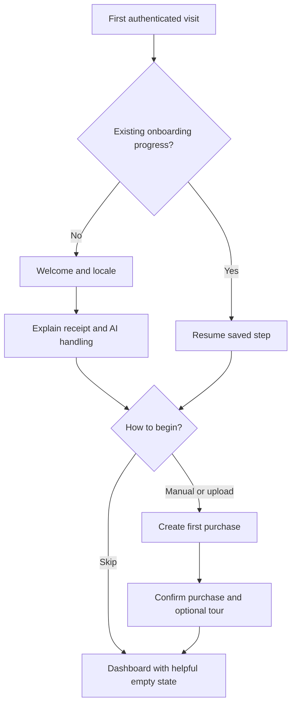

Do not force onboarding on every login or make a user complete every tutorial to use the app. Provide a **Learning Center (T10)** featuring 11 specific, replayable walkthrough modules:

1. **Overview:** attention queue, upcoming deadlines and recent purchases.

2. **Add purchase:** upload/manual choice, privacy, processing, review and confirmation.

3. **Purchases:** search/filter, transaction detail, editing and receipt access.

4. **Products:** inventory, identifiers, linked purchase and timeline.

5. **Returns & warranties:** confirm terms, add deadline, reminders and mark returned.

6. **Safety alerts:** evidence, missing identifiers, jurisdiction and original source.

7. **Spending:** date/currency filters, chart/table and underlying records.

8. **Documents:** find, preview, retain, download and delete.

9. **Notifications:** inbox, preferences and permission handling.

10. **Settings:** appearance, profile, security, export and privacy controls.

11. **Households:** optional later-release module for permissions and sharing.

Use sample data for teaching. Never perform a real deletion, export, invitation, notification opt-in or AI submission merely because the tour advances.

---

## 6. Receipt, redaction, and purchase workflow

### 6.1 Upload and Extraction Path

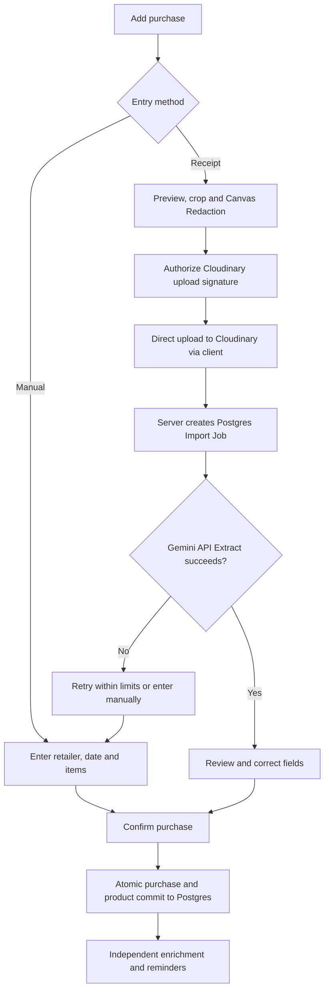

1. **Client Redaction:** Users optionally redact sensitive information using an HTML5 Canvas element in the browser before generating the file payload.

2. **Signed Upload:** The Next.js API generates a Cloudinary SHA-1 signature, allowing the client to push the image directly to Cloudinary without hitting Vercel's body size limits.

3. **Extraction:** A Postgres-backed background queue calls Gemini 1.5 Flash using a strict JSON schema prompt.

4. **Conflict Resolution:** If the user opens the review in two tabs, a revision check returns a conflict to preserve unsaved edits.

### 6.2 Import State Machine

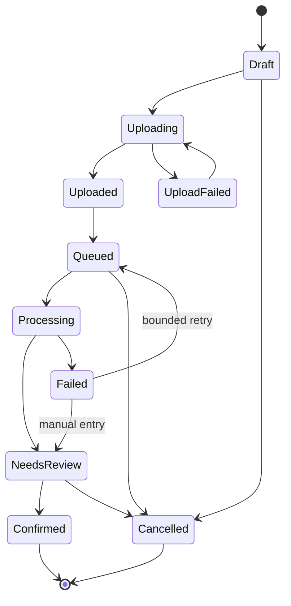

### 6.3 Recovery Rules

| Failure                     | Required behavior                                            |
| --------------------------- | ------------------------------------------------------------ |
| Network fails during upload | Retain local form; offer retry; never claim upload completed |

|
| Cloudinary succeeds, Gemini fails | Show saved receipt and manual-entry option

|
| Storage succeeds, Postgres write fails | Reconcile admitted object and import ID; garbage-collect unclaimed objects

|
| User reloads while processing | Fetch existing Postgres job; do not create another extraction

|
| Commit succeeds, response is lost | Retry same idempotency key and receive same purchase ID

|
| User opens review in two tabs | Revision check returns conflict; preserve unsaved edits for comparison

|
| One enrichment source fails | Keep saved purchase and display incomplete enrichment

|

---

## 7. Data model, RLS, and ownership

### 7.1 Entity Relationships

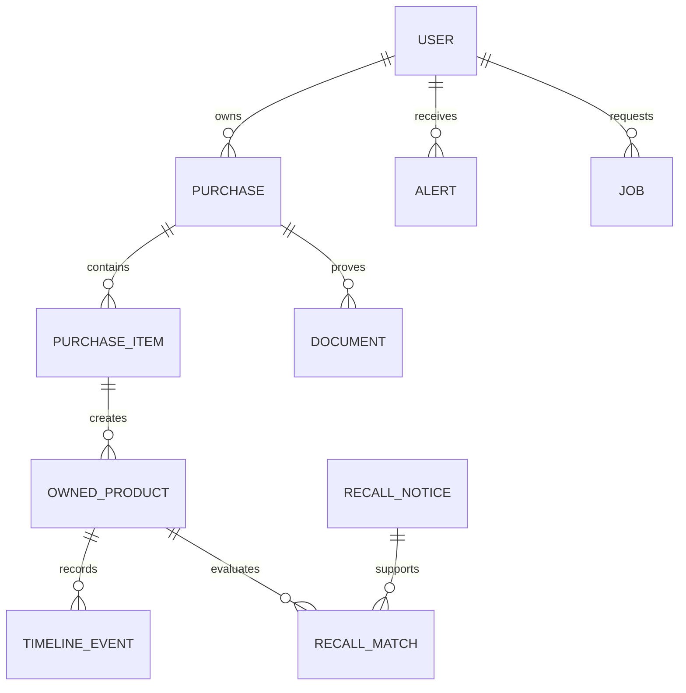

### 7.2 Proposed PostgreSQL Schema and RLS

Supabase utilizes PostgreSQL. Data must be relational and protected via Row Level Security (RLS).

| Table            | Essential fields                                                              | Writer / RLS Policy          |
| ---------------- | ----------------------------------------------------------------------------- | ---------------------------- |
| `profiles`       | id, display_name, country_code, default_currency, timezone, daily_ai_consumed | `auth.uid() = id`            |
| `purchases`      | id, user_id, retailer, purchased_on, total_minor, currency, revision          | `auth.uid() = user_id`       |
| `purchase_items` | purchase_id, description, quantity, line_total_minor                          | `auth.uid() = user_id`       |
| `products`       | id, purchase_id, name, model, barcode, ownership_status, return_deadline      | `auth.uid() = user_id`       |
| `documents`      | id, user_id, document_type, cloudinary_secure_url, mime_type                  | `auth.uid() = user_id`       |
| `imports`        | id, user_id, status, extraction_draft, idempotency_key                        | `auth.uid() = user_id`       |
| `alerts`         | id, user_id, product_id, alert_type, evidence, is_read                        | `auth.uid() = user_id`       |
| `recall_matches` | product_id, match_level, missing_fields, checked_at                           | Matching worker              |
| `job_queue`      | id, task_type, payload, status, locked_until, attempts                        | Server API Only (No UI read) |

Split safe job status (`imports` table) from internal job details (`job_queue`). Do not put provider secrets, raw IP addresses, complete prompts or privileged roles into user-readable documents.

### 7.3 Field Provenance

For uncertain fields, store `value`, `source_type`, `source_ref`, `observed_at` and `user_confirmed_at`. Source types include `user`, `receiptExtraction`, `publicProductAPI`, `officialNotice` and `policyDocument`. Enrichment may suggest a brand or category, but it must not silently overwrite user-confirmed model numbers, prices, serial numbers or purchase dates.

---

## 8. Money dates and business rules

### 8.1 Money

Represent money as integer minor units using currency metadata. Do not assume every currency has two decimal places. For NGN and USD, two decimal places means ₦1,250.50 is stored as `125050`. Validate safe integer ranges.

Proposed accounting identity:
`purchase total = item subtotal − purchase discount + tax + shipping + explicit rounding adjustment`

Store receipt total separately from computed total until a discrepancy is resolved. Track returns/refunds as separate events. Net spending equals confirmed totals less recorded refunds.

Show each currency separately. Optional future conversions must include rate source, rate date and an estimate label; never silently add NGN and USD.

### 8.2 Dates and policy calculation

Keep purchase dates as local calendar dates such as `2026-09-14`; retain timestamps for events such as uploads. Server time controls expiry, quotas and security checks; browser time does not.

If a fictional policy allows 30 calendar days after 14 September 2026, excluding the purchase day, the resulting date is 14 October 2026. Unknown terms produce **“Return deadline unknown — add policy”**, not a guessed date.

### 8.3 Product lifecycle

Track `owned`, `returned`, `sold`, `gifted`, `lost`, `disposed` and `archived` as explicit states. Changing state updates future reminders without erasing purchase evidence. A completed return does not imply money was refunded; record refund status separately.

---

## 9. Product enrichment

Start with exact barcode lookup using the Open Food Facts API (free, community-maintained). Check attribution/licensing requirements. Do not treat a barcode as a manufacturer's verified statement.

| Input                | Processing                              | Result                 |
| -------------------- | --------------------------------------- | ---------------------- |
| Valid barcode string | Preserve leading zeros; validate format | Exact lookup candidate |

|
| Brand and model | Normalize whitespace and aliases | Candidate search

|
| Generic receipt text | Ask for model or label photo | Incomplete identification

|
| Product not found | Cache short-lived negative result | Normal empty result

|
| Conflicting fields | Present comparison and ask user | No silent overwrite

|

Normalize case and spacing, but do not remove meaningful model suffixes. `AB-120`, `AB-120B` and regional variants are not automatically the same product. Public API requests must contain only necessary public identifiers; never forward the entire purchase, receipt, or email to a barcode database.

---

## 10. Recall matching and explanation

CPSC provides a consumer-product recall API. openFDA exposes food enforcement recall records. Implement separate adapters and label jurisdiction.

### 10.1 Matching flow

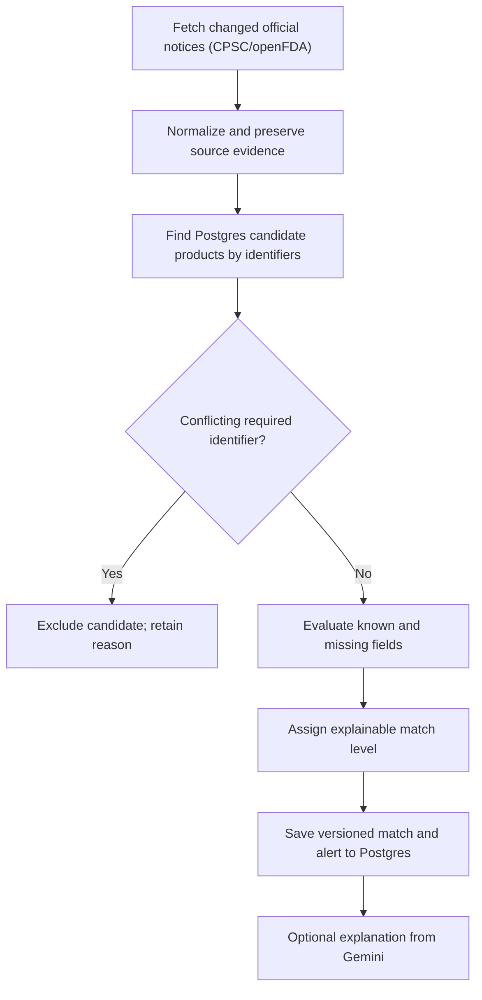

Maintain server-only candidate indexes by normalized brand/model/barcode and update only affected records. Never expose which users own which models publicly.

### 10.2 Match levels

| Level            | Conditions                                                            | User message                                              |
| ---------------- | --------------------------------------------------------------------- | --------------------------------------------------------- |
| Identifier match | Exact identifiers match the notice and all restrictions are satisfied | Identifiers match this notice; review the official remedy |

|
| Possible match | Brand/model matches but lot, serial, date or region is missing | Additional information is needed

|
| Weak candidate | Name/category similarity only | Possible related notice; not confirmed for your product

|
| Excluded | Known model, lot or serial contradicts scope | This candidate does not match the supplied identifiers

|
| Not checked | Coverage missing or source fetch failed | Safety check unavailable or incomplete

|

Prefer these labels over an uncalibrated “96% confidence”. High name similarity must not override an explicit identifier conflict.

### 10.3 Evidence view example

| Field | Your product    | Fictional notice | Interpretation |
| ----- | --------------- | ---------------- | -------------- |
| Brand | Example Devices | Example Devices  | Match          |

|
| Model | PB-120 | PB-120 | Match

|
| Serial | Not provided | Specified range | Needs verification

|
| Purchase region | Nigeria | US distribution | Coverage requires review

|

Display source link, notice publication date, source revision, last checked time and unresolved conditions. Use **“No matching notices found in the sources checked as of [time]. Coverage is limited.”**

---

## 11. AI boundaries and privacy

### 11.1 Permitted capabilities

| Capability         | Input                                 | Output                                  | Human or deterministic gate         |
| ------------------ | ------------------------------------- | --------------------------------------- | ----------------------------------- |
| Receipt extraction | Approved image and constrained schema | Retailer, date, currency, items, totals | User reviews before purchase commit |

|
| Product-label extraction | Cropped label | Brand/model/barcode candidates | User confirms identifiers

|
| Warranty extraction | Limited document pages | Coverage candidates and excerpts | User confirms; unknown remain unknown

|
| Recall explanation | Retrieved notice and match evidence | Short explanation and missing info | Official notice remains visible

|
| Return question | Authorized purchase and policy result | Optional explanation | Deterministic calculation supplies deadline

|

Do not spend an AI call to calculate a total, count remaining days, mark an alert read or search already-loaded purchases.

### 11.2 Private receipts and provider terms

Gemini's unpaid-service terms describe data use that differs from paid-service handling. **Default policy:** free extraction requires explicit consent. Allow cropping and client-side redaction (Canvas API) of names, addresses, and card fragments before uploading. Redaction is best-effort. Keep manual entry available.

### 11.3 Constrained AI contract

```json
{
  "schemaVersion": 1,
  "retailer": "Example Store",
  "purchaseDate": "2026-09-14",
  "currency": "NGN",
  "items": [
    {
      "name": "Example Headphones",
      "quantity": 1,
      "unitPriceText": "25000.00",
      "lineTotalText": "25000.00",
      "needsReview": false
    }
  ],
  "totalText": "25000.00",
  "warnings": [],
  "missingFields": []
}
```

The server parses decimal strings into bounded minor-unit values, validates dates, limits field lengths, rejects unexpected properties, and detects total mismatches. Treat self-reported model confidence as uncalibrated; prefer `needsReview`.

### 11.4 Prompt injection and output handling

Use a fixed task and schema, no browsing or arbitrary tools, no secrets in prompts and no access to unrelated purchases. Validate structured output, render text safely, prohibit executable HTML and accept source links only from retrieved evidence. Do not let AI output select an owner ID, storage path, database query, provider URL or quota.

---

## 12. React & Next.js architecture

Use Next.js App Router, React, TypeScript, and Tailwind CSS. Pin compatible versions.

| State category    | Owner           | Examples                             |
| ----------------- | --------------- | ------------------------------------ |
| Local interaction | Component state | Open menu, preview tab, selected row |

|
| Complex local workflow | Reducer | Import review steps, dirty fields, conflict resolution

|
| Form state | React Hook Form | Validation, touched fields, item arrays

|
| URL state | Router/search params | Search, category, sort, date range

|
| Remote records | TanStack Query | Purchases, products, alerts, job status

|
| Global identity/preferences | Small contexts | Current user, locale, theme

|
| Deterministic calculations | Pure domain functions | Money, deadlines, matching

|

Domain functions must be independent of JSX. Lazy-load analytics and document processing screens. Optimistically update reversible preferences with rollback. Purchase confirmation, account deletion, export and AI jobs require server acknowledgment. Preserve user edits when a refresh arrives; do not reset a dirty form from a listener snapshot.

---

## 13. API contracts and request admission

Implemented as Next.js Route Handlers (`app/api/...`).

| Endpoint                     | Purpose                     | Mandatory gates                                |
| ---------------------------- | --------------------------- | ---------------------------------------------- |
| `POST /api/upload/authorize` | Issue Cloudinary signed URL | Auth, account active, size limits, daily quota |

|
| `POST /api/imports` | Enqueue Gemini extraction task | Cloudinary URL validation, idempotency, budget

|
| `GET /api/jobs/:id` | Safe job status | Ownership; no internal error payload

|
| `POST /api/purchases` | Commit reviewed purchase | Ownership, schema validation, total math check

|
| `PATCH /api/purchases/:id` | Update purchase | Ownership, expected revision, allowed fields

|
| `POST /api/products/:id/enrich` | Call Open Food Facts | Ownership, cache, cooldown, provider budget

|
| `POST /api/cron/process-jobs` | Trigger background runner | Secret CRON_SECRET auth header |

### 13.1 Admission order

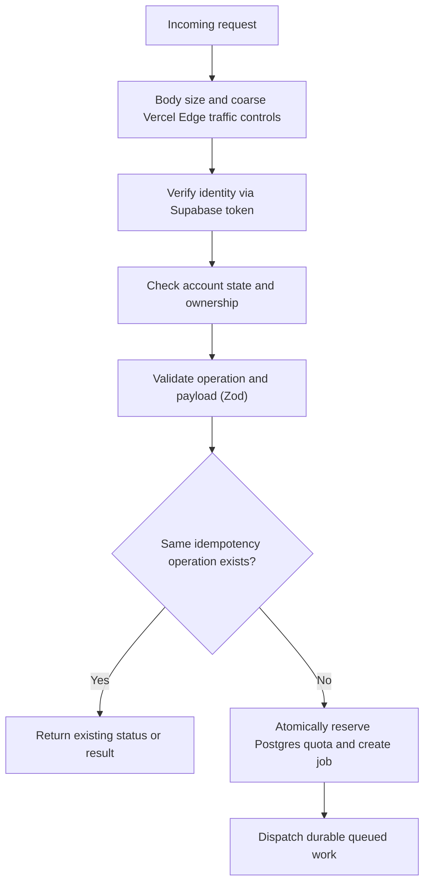

The caller cannot select another UID. Derive UID from the verified token and scope all resource retrieval to it. Use a stable error shape: `code`, `message`, `requestId`, optional `retryAfterSeconds`, optional safe field errors. Never return provider keys, stack traces or another user's resource existence.

---

## 14. Preventing account theft

| Threat          | Proposed control                                | Remaining limitation                            |
| --------------- | ----------------------------------------------- | ----------------------------------------------- |
| Reused password | Supabase strong password policy, verified email | Compromised email/provider compromises recovery |

|
| Automated guessing | Supabase built-in rate limits | Custom API limits do not automatically cover Auth endpoints

|
| Phishing | Clear official origin, user-visible security events | Users may still approve fraudulent prompts

|
| Stolen access token | Short-lived tokens, Postgres `valid_after` epoch | Attacker may act before revocation is enforced

|
| XSS session abuse | Safe rendering, restrictive CSP, no arbitrary HTML | A serious XSS can act as the user while active

|
| Shared computer | Explicit Remember me; clear caches on sign-out | Downloaded copies cannot be recalled

|
| Sensitive operation | Require recent reauthentication for export/delete | Reauth is weaker if primary credentials compromised

|

**Sign Out Everywhere:** The server updates the `profiles.valid_after` timestamp. RLS policies must strictly compare token issuance time against this field to instantly block stolen, unexpired tokens.

### Recovery workflow

1. User reports suspicious access or selects Sign out everywhere.

2. Server updates `valid_after` epoch in Postgres.

3. Sensitive operations stop, clients clear private cache and the user signs in again.

4. User changes compromised credentials and reviews recovery methods.

---

## 15. IP abuse and zero-cost quotas

An IP address is not a person or reliable device identity. Mobile networks change IPs; many Nigerian users may share carrier-grade NAT. VPNs and proxies exist. Do not permanently bind an account to one IP.

### 15.1 Proposed pilot limits (Postgres Enforced)

| Operation      | Per-account default | Additional protection         |
| -------------- | ------------------- | ----------------------------- |
| Manual commits | 20/minute, 200/day  | Valid item and payload limits |

|
| Upload signatures | 5/minute, 20/day | 10 MiB/file Cloudinary limit

|
| Gemini extraction | 5/day total | Global budget and Postgres queue

|
| Product enrichment | 20/minute | Shared Postgres cache first

|
| Manual recall refresh | One/product/15 mins | Uses ingested dataset

|
| Export | One/day | Recent reauthentication

|
| Public demo (`/demo`) | Local in-memory only | No production mutation or AI credentials

|

### 15.2 Response ladder

| Signal       | Response                           |
| ------------ | ---------------------------------- |
| Normal burst | Short queue or 429 with retry time |

|
| Repeated costly requests | UID cooldown; require deliberate user action

|
| Suspected automation | Restricted expensive operations

|
| Clear abuse | Suspend costly access or account; log reason

|
| Widespread attack | Pause AI/uploads, reduce admitted work

|

---

## 16. Authorization and data isolation

### 16.1 Permission matrix

| Resource       | Anonymous           | Owning active user  | Another user        | Next.js API Worker |
| -------------- | ------------------- | ------------------- | ------------------- | ------------------ |
| Synthetic demo | Read local fixtures | Read local fixtures | Read local fixtures | Not needed         |

|
| Private purchase | Deny | Bounded read via RLS | Deny | Only authorized task

|
| Private receipt | Deny | Authorized Cloudinary URL | Deny | Signed preset only

|
| Extraction draft | Deny | Read and review via RLS | Deny | Assigned import

|
| Public product metadata | Sanitized public read | Read | Read | Controlled write

|
| Postgres job ledger | Deny | No direct read/write | Deny | Service role only

|

Start with default-deny Postgres RLS rules.

### 16.2 Common leak paths to block

| Leak path                    | Requirement                                |
| ---------------------------- | ------------------------------------------ |
| Guessing another purchase ID | RLS `auth.uid() = user_id`; returns 0 rows |

|
| Cached response from prior account | Include UID in React Query keys; clear cache on sign-out

|
| Shared public cache contains PII | Separate public records from user-derived records

|
| Logs capture request body | Log metadata and safe error codes, not content

|
| AI prompt includes full inventory | Retrieve only authorized fields needed for the task

|
| Export object left public | Private ZIP object, short-lived authorization, auto cleanup

|

---

## 17. Upload pipeline and document security

Start with JPEG, PNG and WebP images. **Proposed limits:** 10 MiB encoded size.

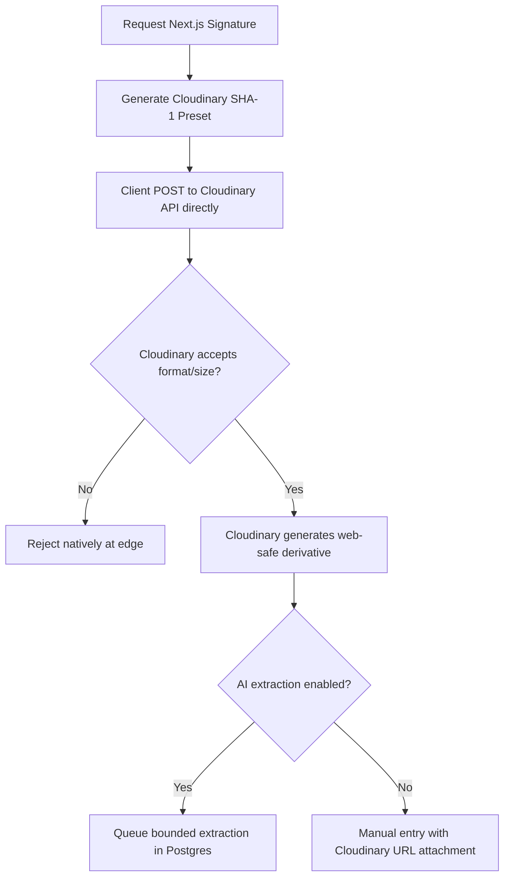

If using signed upload policies, constrain object path, allowed extensions, and create-only semantics. Validate the finalized Cloudinary URL before inserting it into the `imports` table.

On deletion, remove originals, thumbnails, and extraction derivatives via the Cloudinary Admin API, not just the visible Postgres document record.

---

## 18. Preventing unnecessary API calls

### 18.1 Cache and request policy

| Data or action | Client policy                            | Shared/server policy                    |
| -------------- | ---------------------------------------- | --------------------------------------- |
| Purchase list  | 60-second freshness (`staleTime: 60000`) | Paginated reads, no whole-history fetch |

|
| Public barcode metadata | Reuse existing result | 7-day TTL in Postgres; key includes locale

|
| Unknown barcode | Show editable empty state | Negative cache for 6 hours

|
| Recall feed | Display last successful check | Scheduled ingestion, every 6 hours

|
| AI extraction | Never auto-repeat on mount | UID + idempotency hash deduplication

|
| Analytics | Query summary period | Incremental monthly aggregates

|

### 18.2 Required client behavior

1. Use stable query keys such as `['purchases', uid, normalizedFilters, cursor]`.

2. Enable private queries only after identity is resolved.

3. Debounce text search, e.g., 350 ms. Cancel superseded requests.

4. Use AbortSignal support.

5. Do not trigger billable work from an effect tied to route mount.

6. Invalidate only affected keys after a mutation; do not refresh the entire app.

7. Stop polling when a job is terminal or a user signs out.

8. Never use both a listener and a polling loop for the same active job.

9. Honor `Retry-After` for 429 errors.

### 18.3 Cache miss coalescing

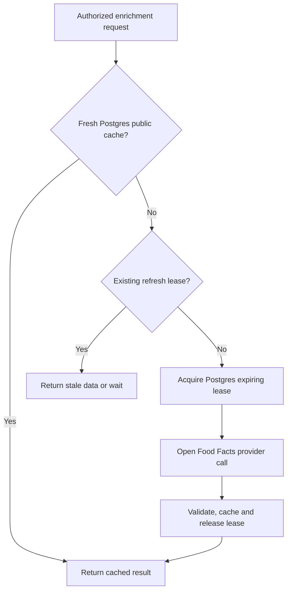

---

## 19. Postgres jobs, retries, and idempotency

### 19.1 Job lifecycle

Because Cloud Tasks requires billing, jobs use a `job_queue` Postgres table.
Workers (Next.js API triggered by Github Cron) atomically claim jobs using `FOR UPDATE SKIP LOCKED`, recheck owner/account status, and verify cancellation. Write results only if the claim is current. Expiring `locked_until` leases prevent a slow old worker from overwriting a newer attempt.

### 19.2 Idempotency contract

The client creates a random operation key (`idempotency_key`) once and reuses it for that user action. Scope the server record by UID and operation. Store a normalized payload hash; the same key with a different payload returns conflict. The same key and payload returns the previous result.

### 19.3 Retry policy

| Failure                        | Policy             |
| ------------------------------ | ------------------ |
| Invalid input or rejected file | No automatic retry |

|
| Unauthorized or deleted resource | Stop permanently

|
| Provider 429 | Exponential backoff; keep queue bounded

|
| Transient network/5xx | Backoff with jitter; at most 3 total attempts

|
| AI malformed output | At most one bounded repair attempt

|
| Attempts exhausted | Failed status and manual recovery; no endless loop

|

---

## 20. Load capacity and graceful degradation

### 20.1 What “under load” means

There are separate bottlenecks: Vercel 10s timeout, Supabase connections, Cloudinary upload bandwidth, Gemini request limits (15 RPM), and queue age.

| Scenario     | Example demand   | Expected designed behavior                   |
| ------------ | ---------------- | -------------------------------------------- |
| Personal use | 1–5 active users | Immediate normal operations; little queueing |

|
| Small pilot | 100 active sessions | Paginated reads; provider calls reused via Postgres

|
| Portfolio spike | 1,000 demo visitors | Mostly CDN/sample work; no production AI surge

|
| Live receipt burst | 100 admitted jobs | Queue processes at max 15 RPM; users see wait state

|
| Provider outage | AI API unavailable | Manual entry and saved records remain usable

|
| Abuse burst | High repeated traffic | Admission limits shed load at Vercel Edge

|

### 20.2 Example capacity calculation

If Gemini permits 15 requests/minute, effective throughput is **at most 15 jobs/minute**. A burst of 100 jobs would take roughly 7 minutes to drain. Set a global pending-job cap, for example 100, and show a capacity message for new work when full. Keep each user to one running and two waiting extraction jobs.

### 20.3 Degradation ladder

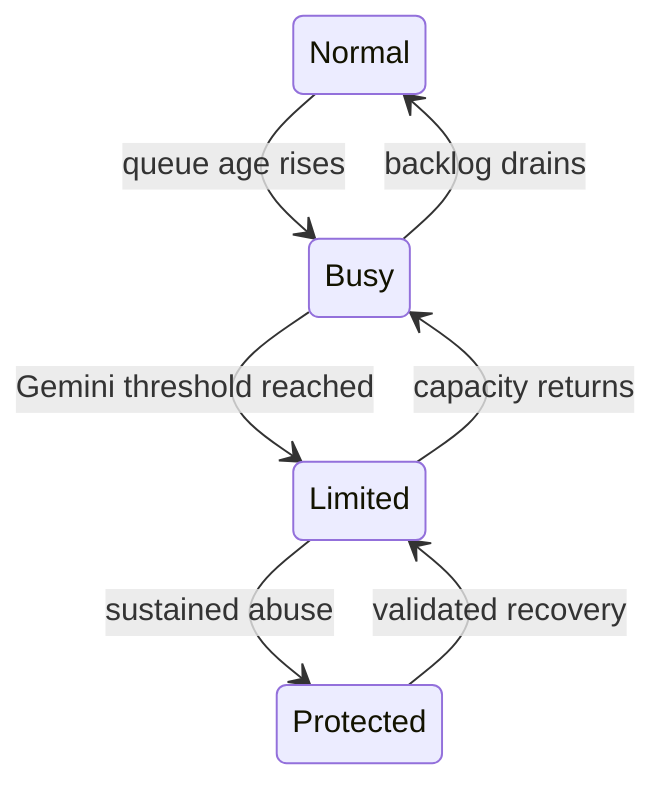

### 20.4 Proposed measurable targets

| Measure                    | Initial target     | Verification |
| -------------------------- | ------------------ | ------------ |
| Core API metadata response | p95 under 1 second | Staging test |

|
| Main-page LCP | At or below 2.5 seconds | Lab test, real-user data

|
| INP / CLS | INP <= 200 ms; CLS <= 0.1 | Interaction/Layout measurement

|
| Cross-account disclosure | Zero | RLS negative tests

|
| Duplicate purchase commits | Zero | Idempotency replay tests

|
| Unbounded queue growth | None | Admission rejects beyond cap

|

---

## 21. Costs, quotas, and emergency controls

### 21.1 Cost model

Zero-cost operation requires strict adherence to free-tier ceilings: `Supabase database operations + Cloudinary file storage + Vercel function compute + Gemini AI limits`.

| Control                             | Purpose                                              |
| ----------------------------------- | ---------------------------------------------------- |
| Per-UID atomic Postgres reservation | Prevent concurrent requests exceeding user allowance |

|
| Max instances and worker concurrency | Bound simultaneous Next.js API compute calls

|
| Cloudinary 10MB limits | Bound storage and processing size

|
| Independent kill switches | Disable AI, uploads or enrichment quickly via DB flags

|
| Keep-Alive Cron | Prevent Supabase from pausing after 7 days

|

If the quota store is unavailable, fail closed for expensive AI/uploads. Existing safe reads can continue according to RLS rules.

---

## 22. Notifications and reminders

Start with in-app reminders and calendar export (`.ics`); add web push only after user preferences work. Proposed reminder offsets: returns at 7 and 2 days before deadline; warranties at 30 and 7 days. Store the confirmed deadline and timezone, not just a browser countdown.

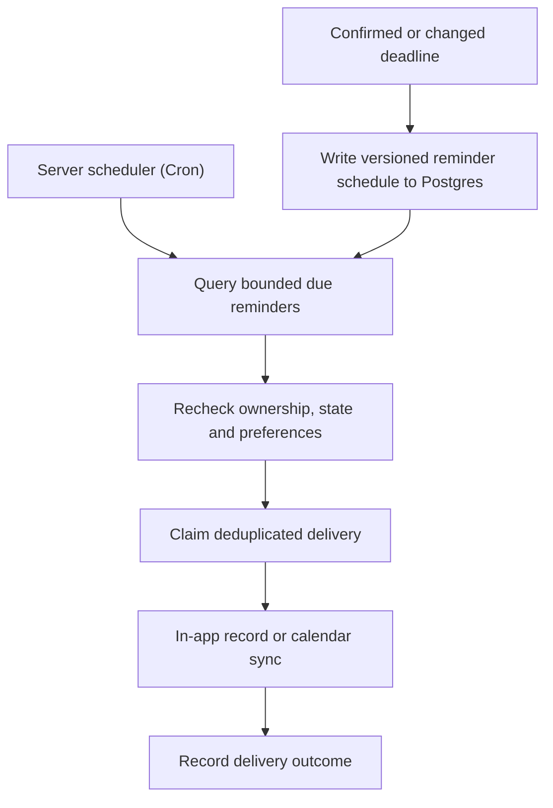

Notification bodies should be discreet by default; do not expose receipt totals or serial numbers on a lock screen.

---

## 23. Offline and synchronization

Default to **no persistent private browser cache** for the pilot; cache only public application assets in the Next.js service worker. Keep an unsaved form in React memory and clearly explain that closing the tab may lose it.

| Situation                     | Behavior                                            |
| ----------------------------- | --------------------------------------------------- |
| Offline while viewing records | Show available React Query cache with Offline label |

|
| Offline while editing | Keep dirty form; disable server-required submission

|
| Offline during upload | Show interrupted state; retry when connection returns

|
| Connection returns | Revalidate revisions before committing

|
| Same item edited on two devices | Return Postgres conflict and let user compare fields

|
| User signs out | Clear React Query cache, previews, and tokens

|

---

## 24. Privacy retention export and deletion

### 24.1 Data minimization

Collect only what serves ownership management. Do not require addresses or payment-card data. Mask serial numbers in list views. Keep PII out of URLs and analytics event names.

### 24.2 Proposed retention policy

| Data                       | Proposed default                 |
| -------------------------- | -------------------------------- |
| Confirmed purchase/product | Until user deletes it or account |

|
| Receipt original | User-selected retention within Cloudinary quota

|
| Unconfirmed import | Remove after 7 days of inactivity

|
| Personal AI result | Keep with related record; delete with it

|
| Generated export | Expire ZIP after 24 hours

|
| Operational logs | 14 days, minimized and redacted

|

### 24.3 Export

Require recent authentication, fetch all user rows via RLS, and stream a ZIP containing structured JSON and a manifest of Cloudinary links. Sanitize CSV cells that begin with formula characters.

### 24.4 Delete account

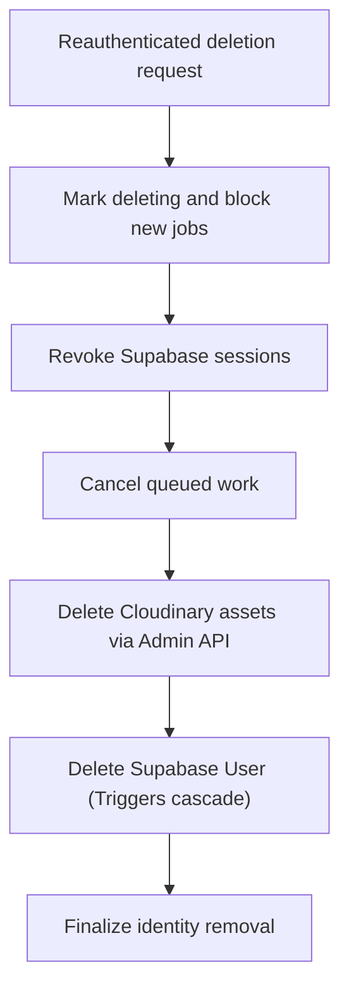

Workers recheck deletion status before storing output. State clearly that already-downloaded files cannot be remotely deleted.

---

## 25. Households and sharing (Later Expansion)

Use a separate household ownership scope with server-managed membership; do not expose a user's whole personal collection.

| Capability                     | Owner | Editor | Viewer |
| ------------------------------ | ----- | ------ | ------ |
| View explicitly shared product | Yes   | Yes    | Yes    |

|
| Add/edit shared products | Yes | Yes | No

|
| Manage members and roles | Yes | No | No

|
| View original receipt | Explicitly shared | Explicitly shared | Explicitly shared

|

Invitation tokens must be random, hashed, expiring, single-use. Recheck membership on every request. Offer redacted attachments instead of automatically sharing the whole receipt for multi-item purchases.

---

## 26. Observability and incident response

### 26.1 What to measure

| Area | Metrics                                     |
| ---- | ------------------------------------------- |
| API  | Requests, p50/p95 latency, safe error codes |

|
| AI | Admitted jobs, tokens, retries

|
| Queue | Depth, oldest age, expired leases

|
| Database | Reads/writes, contention

|
| Uploads | Cloudinary Bytes, rejected files

|
| Security | Auth failures, revoked-session attempts

|

Configure error-reporting SDKs to redact fields. Avoid session replay on private screens.

### 26.2 Incident playbooks

| Incident              | Immediate action                    | Recovery evidence                               |
| --------------------- | ----------------------------------- | ----------------------------------------------- |
| Gemini 429 limits hit | Pause new AI jobs and inspect quota | Worker queue throttled; jobs fallback to manual |

|
| Cross-user access bug | Disable access path; patch RLS | Reproducing test fails before fix and passes after

|
| Account takeover | Revoke sessions via `valid_after` | Old sessions denied on API and direct RLS reads

|
| Provider outage | Serve stored data, enable manual flow | Controlled probe succeeds before reopening

|
| Worker duplicates | Reconcile Postgres ledger | No duplicate purchases in replay test

|

---

## 27. Testing and acceptance criteria

### 27.1 Domain and UI tests

| Area  | Necessary examples                                   |
| ----- | ---------------------------------------------------- |
| Money | Currency precision, discounts, refunds, large values |

|
| Dates | Leap day, timezone change, unknown policy

|
| Matching | Exact model, suffix conflict, excluded lot

|
| AI parsing | Invalid JSON, hallucinated fields, missing currency

|
| Review form | Validation focus, preserved edits, revision conflict

|

### 27.2 Security tests (RLS & API)

Run tests in the Supabase local emulator.

1. User A cannot read, list, edit, delete, or export user B's resources using guessed valid IDs.

2. Direct writes bypassing `user_id` RLS checks are denied.

3. A revoked session (`valid_after` update) is rejected by API and protected reads.

4. Quota counters cannot be changed from the browser.

5. Concurrent requests cannot exceed admission allowance.

6. A signed Cloudinary upload cannot overwrite a validated object.

7. Malformed/oversized files are rejected before AI calls.

8. Switching accounts clears cached private content.

### 27.3 Load test plan

Use k6 or Artillery with provider stubs. Do not load-test free public APIs.

| Test     | Workload             | Pass condition  |
| -------- | -------------------- | --------------- |
| Baseline | One complete journey | Correct records |

|
| Pilot reads | Ramp to 100 active sessions | Target latency; bounded reads

|
| Extraction queue | 100 synthetic jobs | Configured concurrency respected (max 15/min)

|
| Concurrent replay | Identical mutation requests | One canonical purchase result (idempotency)

|
| Shared IP | Many legitimate accounts | No low-threshold blanket exclusion

|

Report actual results: p95, error rate, queue age.

---

## 28. Implementation tickets

| Ticket | Deliverable                                | Acceptance / evidence                     |
| ------ | ------------------------------------------ | ----------------------------------------- |
| AB-001 | App shell, Next.js routes, Tailwind tokens | Responsive navigation, 44px touch targets |

|
| AB-002 | Synthetic demo data (`/demo`) | Clearly labeled samples; no external calls

|
| AB-003 | Money/date domain utilities | Edge-case tests; documented assumptions

|
| AB-004 | Supabase Auth and Onboarding | Verify/reset flow, `valid_after` token checks

|
| AB-005 | Postgres Schema & RLS | Two-user negative tests; default-deny behavior

|
| AB-006 | Manual purchase form | Accessible validation, computed totals, preserved draft

|
| AB-007 | Purchase inventory | Search/filter URL state, pagination

|
| AB-008 | Idempotent purchase commit | Retry and concurrent replay return same result

|
| AB-009 | Client Canvas Redaction | Working PII blackout tool before upload

|
| AB-010 | Cloudinary signed upload | Byte limits (10MB), malformed file rejection

|
| AB-011 | Postgres job queue & status | Dispatch reconciliation, bounded attempts

|
| AB-012 | Gemini extraction and review | Consent, schema validation, manual fallback

|
| AB-013 | Return/warranty timeline | Unknown terms, policy source, date revisions

|
| AB-014 | Reminders and iCal export | Dedupe, timezone handling, revised schedules

|
| AB-015 | Currency-separated analytics | No double counts; refund adjustments

|
| AB-016 | Open Food Facts adapter | Shared Postgres cache, coalesced request test

|
| AB-017 | CPSC/openFDA recall adapter | Identifier conflicts, missing fields, coverage labels

|
| AB-018 | Evidence explanation UI | No invented source links

|
| AB-019 | Rate limits & Keep-Alive Cron | GitHub Actions ping active, fail-closed tests pass

|
| AB-020 | Export and durable deletion | No orphan Cloudinary files or late worker recreation

|
| AB-021 | 11-Module Learning Center | Replayable walkthrough modules with sample data

|
| AB-022 | Accessibility & Responsive Review | Light/Dark variants confirmed, no button wrapping

|
| AB-023 | Public portfolio release | Honest feature matrix, demo environment

|
| AB-024 | Later household permissions | Member removal isolation tests

|

Suggested order: AB-001–007 establish the Next.js/Supabase foundation; AB-008–012 build the AI/Cloudinary intake; AB-013–018 add product intelligence; AB-019–024 finish hardening and design polish.

---

## 29. Recruiter demonstration and engineering evidence

### Two-minute product demonstration

| Time  | What reviewer does                         | What it demonstrates                                               |
| ----- | ------------------------------------------ | ------------------------------------------------------------------ |
| 0–20s | Opens `/demo` and sees a synthetic receipt | Clear product purpose, low-friction access, zero-cost architecture |

|
| 20–50s | Reviews extraction, redacts image, corrects item | Canvas HTML5 API, forms, derived totals

|
| 50–80s | Saves and opens product timeline | Data flow, Next.js routing, business logic

|
| 80–105s | Opens a potential recall match | Explainable evidence and uncertainty handling

|
| 105–120s | Simulates AI offline | Graceful degradation and honest boundaries

|

### React skills with legitimate uses

| Skill              | Evidence in this project                       |
| ------------------ | ---------------------------------------------- |
| Components & props | Reusable cards, field groups and evidence rows |

|
| State & reducers | Receipt-review state transitions

|
| Effects | Subscription cleanup and external synchronization

|
| Context | Auth/preferences and Light/Dark theme

|
| Custom hooks | Auth-scoped React Queries, upload progress

|
| Forms & validation | Multi-item purchase review (Zod)

|
| Router state | Nested details, reproducible filters

|
| Error boundaries | Isolated screen failures

|
| Testing | RLS negative tests, E2E idempotency evidence

|

Strong interview questions to answer: Why does IP limiting not replace Supabase RLS? How does a repeated Confirm click remain safe (Idempotency)? How do you prevent a signed-out user's data appearing in the next account (`valid_after` checks)? Why does an unknown recall result not mean safe?

---

## 30. Launch checklist and open decisions

### Required before a real-user pilot

- [ ] Supabase RLS tests pass on every access path.

- [ ] Country/currency support and recall coverage accurately described.

- [ ] Manual entry works without Gemini, Open Food Facts, or Cloudinary.

- [ ] `valid_after` token revocation instantly blocks stolen sessions.

- [ ] Direct mutations cannot bypass Next.js API quotas.

- [ ] Cloudinary preset restricts bytes, dimensions, and MIME types.

- [ ] Gemini output cannot trigger arbitrary SQL queries.

- [ ] Canvas Redaction tool works on mobile touchscreens.

- [ ] GitHub Actions Keep-Alive cron is active and passing.

- [ ] Export and Cloudinary purge deletion tested.

- [ ] All 102 screens verified in both Light and Dark mode.

- [ ] Demo fixtures (`/demo`) explicitly isolated from real Postgres records.

```

```
````
